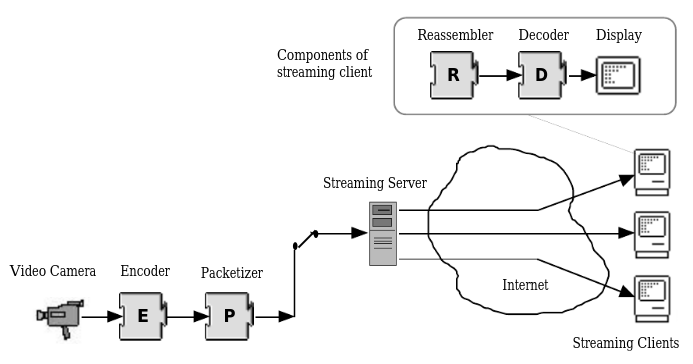
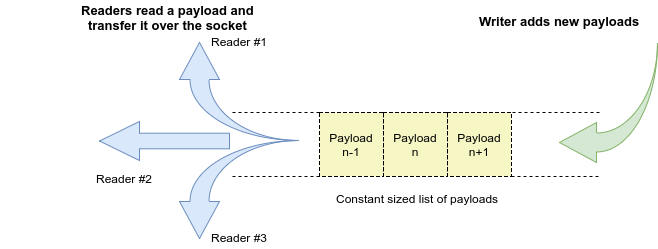

# Concurrent feedback-driven video broadcast protocol

## Dependencies
* OpenCV (3.2.0)
* numpy

## Implementation overview
An overview of the implemented design -  



### The reader-writer model
The implemented reader-writer model depicting 3 concurrent readers -  


### [Project Report](report/cs425-mini-project.pdf)

## Instructions
The current setup performs the transfer locally at localhost.

* Start the server -
  ```
  python -O server.py <port>
  ```
  To enable debug mode, remove the `-O` flag.  
  The server retrieves `frames_per_payload` number of frames from the webcam and constructs the following payload which is transferred -    


* Start the client -
  ```
  python client.py <port>
  ```
  This will retrieve the payload from server, unpack and convert to numpy array appropriately, rendering the frames on the fly.
